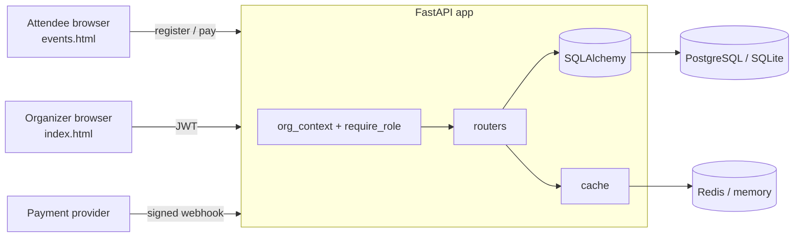

# EventForge

A multi-tenant event hosting platform. Organizations create events, sell tickets, take payments, and check guests in at the door. Each organization's data is isolated from every other's, and access inside an organization is controlled by roles.

- **Organizer console** (`/`): events, ticket types, registrations, door check-in, team roles, audit log
- **Public attendee page** (`/events.html?org=<slug>`): browse published events, reserve tickets, pay, look up a ticket by code
- **REST API** (`/docs` for the interactive OpenAPI UI)

  

## What it demonstrates

| Concern | How it's handled |
|---|---|
| **Multi-tenancy** | Shared schema. Every tenant-owned row carries `org_id`. All `/api/orgs/{org_id}/…` routes go through one `org_context` dependency that checks membership, then every query is filtered by that `org_id`. Non-members get `404` (not `403`), so org existence doesn't leak. |
| **RBAC** | Four roles (`viewer < staff < admin < owner`) enforced by a `require_role()` dependency factory. Admins can't mint or remove owners; the last owner can't be demoted. |
| **Auth** | Short-lived JWT access tokens plus **rotating refresh tokens**. Re-presenting an already-rotated refresh token revokes the whole token family (theft detection). PBKDF2-SHA256 password hashing. Login rate limiting. |
| **No overselling** | Seats are reserved with a single conditional `UPDATE … WHERE sold + qty <= capacity`, so concurrent buyers can't take the last ticket. Unpaid holds expire after 15 minutes and release their seats. |
| **Payments** | Provider-style flow: create intent, then a **HMAC-signed webhook** confirms it. Events are recorded in an idempotency ledger, so replayed webhooks are harmless. A demo mode simulates the provider (see below). |
| **Caching** | Public event listings are cached (Redis, or in-process fallback) and invalidated on every write that changes what attendees see. |
| **Audit trail** | Sensitive actions (event changes, role changes, check-ins, payments) are written to a per-org audit log visible to admins. |

## Architecture



```
backend/app/
  main.py        app factory, static frontend mount
  config.py      env-driven settings
  models.py      User, Organization, Membership, Event, TicketType, Registration, Payment, AuditLog, …
  deps.py        get_current_user, org_context (tenant gate), require_role (RBAC)
  security.py    password hashing, JWT, webhook signing
  cache.py       Redis-or-memory cache
  routers/       auth, orgs, events, public (attendee + webhooks)
backend/tests/   15 API tests (tenancy, RBAC, refresh rotation, oversell, webhooks, …)
frontend/        index.html + app.js (console), events.html + public.js (attendees), styles.css, api.js
```

## Quick start

### Option A: Docker (PostgreSQL + Redis)

```bash
cp .env.example .env          # then set SECRET_KEY and WEBHOOK_SECRET
docker compose up --build
```

Open <http://localhost:8000>. API docs are at <http://localhost:8000/docs>.

### Option B: local Python (SQLite, no other services)

```bash
cd backend
python -m venv .venv && source .venv/bin/activate      # Windows: .venv\Scripts\activate
pip install -r requirements-dev.txt
python -m scripts.seed                                  # optional demo data
uvicorn app.main:app --reload
```

Open <http://localhost:8000>. With seed data, log in as `demo@example.com` / `demo12345`; the public page is at `/events.html?org=northside`.

## Open in VS Code

```bash
unzip eventforge.zip && code eventforge
```

1. Accept the recommended extensions (Python, Docker) when prompted.
2. Create the environment: in the terminal run `cd backend && python -m venv .venv && source .venv/bin/activate && pip install -r requirements-dev.txt` (Windows: `.venv\Scripts\activate`).
3. Press `Ctrl/Cmd+Shift+P`, choose **Python: Select Interpreter**, and pick the `backend/.venv` one.
4. Open **Run and Debug** (`Ctrl/Cmd+Shift+D`) and start **EventForge API (debug, auto-reload)**, then visit <http://localhost:8000>. Breakpoints in `backend/app/**` work.
5. Run **Seed demo data** from the same dropdown for a ready-made account, or open the **Testing** panel to run the 15 tests.

### Run the tests

```bash
cd backend && python -m pytest -q
```

## Using it

1. **Sign up**, then create an organization (you become its owner).
2. **Events → New event**, add one or more ticket types (price `0` makes a free ticket), then **Publish**.
3. Share the public link from **Overview**. Attendees register with no account; free tickets confirm instantly, paid tickets hold seats for 15 minutes.
4. At the door, open **Check-in** and type or scan the `EF-XXXXXXXX` code. Double scans and unpaid tickets are rejected.
5. **Team** lets admins add existing users by email and assign roles.

### Role permissions

| Action | viewer | staff | admin | owner |
|---|:-:|:-:|:-:|:-:|
| View events, stats, team | ✓ | ✓ | ✓ | ✓ |
| View registrations, check guests in | | ✓ | ✓ | ✓ |
| Create/edit/publish events, ticket types, cancel registrations | | | ✓ | ✓ |
| Manage members (not owners), view audit log | | | ✓ | ✓ |
| Grant/remove owner role | | | | ✓ |

## API overview

| Method & path | Auth | Purpose |
|---|---|---|
| `POST /api/auth/register` · `login` · `refresh` · `logout` | – | Session management |
| `GET /api/auth/me` | user | Current user |
| `POST/GET /api/orgs` | user | Create / list my organizations |
| `GET /api/orgs/{id}/stats` | member | Dashboard figures |
| `GET/POST/PATCH/DELETE /api/orgs/{id}/events…` | member / admin | Events and ticket types |
| `GET /api/orgs/{id}/events/{eid}/registrations` | staff | Attendee list |
| `POST /api/orgs/{id}/check-in` | staff | Check in by code |
| `GET/POST/PATCH/DELETE /api/orgs/{id}/members…` | member / admin | Team management |
| `GET /api/orgs/{id}/audit` | admin | Audit log |
| `GET /api/public/{slug}/events` | – | Cached public listing |
| `POST /api/public/{slug}/events/{eid}/register` | – | Reserve tickets |
| `POST /api/public/registrations/{code}/pay` | – | Create payment intent |
| `POST /api/webhooks/payments` | HMAC | Provider webhook (`X-Signature` = HMAC-SHA256 of body) |

## Payments: demo mode vs. a real provider

With `PAYMENT_MODE=demo` (the default), the public page's **Pay** button calls `/api/public/payments/{ref}/confirm-demo`, which builds a payment event and runs it through the same idempotent handler the real webhook uses. **No money moves.**

To go live, set `PAYMENT_MODE=live` (which disables the demo endpoint), create the intent with your provider's SDK inside `create_payment_intent`, and point the provider's webhook at `/api/webhooks/payments`. If the provider uses a different signature scheme (Stripe's, for instance), adapt `verify_webhook` in `security.py` accordingly.

## Honest limitations

This is a strong foundation, not a finished product. Before real use:

- **Tenant isolation is enforced in application code.** For defense in depth on PostgreSQL, add row-level security policies keyed on `org_id`.
- **Schema is created with `create_all`.** Adopt Alembic migrations for production.
- **Confirmation emails are logged, not sent.** `_send_confirmation` in `routers/public.py` is the hook for SES/SendGrid.
- **Background work uses FastAPI `BackgroundTasks`**, which is in-process. Move to a queue (Celery/RQ/Arq) for retries and durability. (The sibling project *Conduit* shows a database-backed worker.)
- **Team invites require an existing account.** There's no emailed invitation flow yet.
- **Access tokens live in `localStorage`** for simplicity. Prefer httpOnly cookies plus CSRF protection for a hardened deployment.
- Tests run on SQLite. The Docker setup targets PostgreSQL 16 and Redis 7 but wasn't exercised in the environment this was built in, so treat the first `docker compose up` as a smoke test.

## Roadmap ideas

Alembic migrations, PostgreSQL RLS, emailed invitations, QR-code tickets and camera scanning, refunds, waitlists, per-org branding, Stripe integration, CSV export.

## License

MIT. See [LICENSE](LICENSE).
